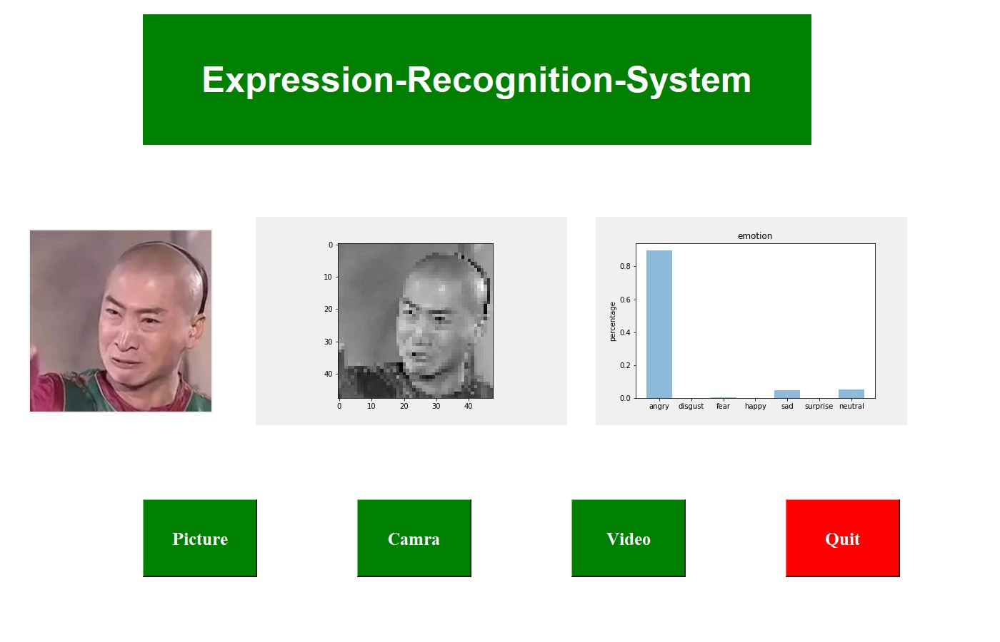
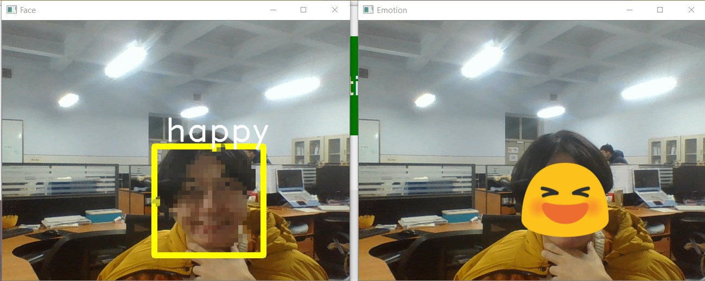
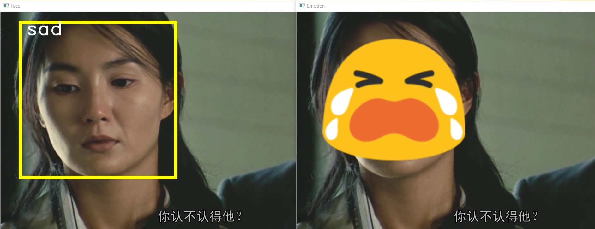

## Facial-Expression-Recognition-System

using the *FER13* of Kaggle as the training dataset

using *VGG16* as the model

using tkinter as the GUI

Function: provide the function of Facial Expression Recognition of picture, video and camera

